# Flash AM32 to Holybro Tekko32 45A Single-ESC (Artery AT32F421) with ST-LINK V2

> [!WARNING]
> This process is irreversible and the BLHeli_32 firmware cannot be restored!

> [!IMPORTANT]
> Check that you have the correct ESC. This article was originally written for the Holybro ESC but applies to other derivatives as well.
> This guide is for the following ESC.
> - [Holybro Tekko32 F4 45A Single-ESC](https://holybro.com/collections/fpv-esc/products/tekko32-f4-45a-esc)
> - [RDQ 3-6S 32bit dShot1200 30A ESC](https://www.racedayquads.com/products/rdq-32bit-esc-30a-3-6s-dshot1200)


> [!NOTE]
> In case of display problems of the images, please load the website as desktop version

## Abstract:
The instructions on this page are for [Artery AT32F421 MCU](https://www.arterychip.com/en/product/AT32F421.jsp) based ESCs.
STM Cube Programmer does not work with the Artery MCUs, instead Keil uVision with ARM-MDK is used.

### Requirements

#### Hardware Requirements
- A JTAG/SWD debug probe that is supported by Keil uVision. Some popular choices are listed below.
  - ST-Link V2 Clones. They are reasonably cheap and usually work for hobbyist applications.
    
  - [Nucleo Boards with built-in ST-Link V2.1](https://www.st.com/en/evaluation-tools/stm32-nucleo-boards.html)

- A BetaFlight passthrough device, like a Flight Controller with an up-to-date BetaFlight or an Arduino flashed with 1-wire sketch.

> [!NOTE]
> Depending on what skill type you are and how many ESCs you want to update, you can choose to solder wires to the test points or to create a Pogo Pin harness.   

- Soldering Option
  - A soldering iron with a very fine SMD tip
  - Very small wires to solder to the test points (0,07mm / AWG28)
- [Pogo Option](#pogo-pin-harness)
  - Needle Type Pogo Pins. P75-B1 from [Adafruit](https://www.adafruit.com/product/2430) did work for me without issues.
  - A drill with corresponding diameter to your pogo pins.
  - A 2-axis coordinate table to achieve sufficient precision for placing the pogo pins.
  - Some wood for the fixture, i.e. some baseplate and some constant thickness piece for the walls.
    The stabilizer of a used firework rocket worked perfectly for me.
  - A piece of transparent plastic like polycarbonate for the top plate. Be aware that it melts if the drill gets too hot.


#### Software Requirements
- [STM Cube Programmer](https://www.st.com/en/development-tools/stm32cubeprog.html#st-get-software) for the st-link drivers and firmware.
- Keil uVision Software, follow the [guide](https://www.keil.arm.com/mdk-community/).
- optinally [BLHeliSuite](https://github.com/bitdump/BLHeli/releases) for flashing the 1-wire sketch to the Arduino
- [ESC Config Tool](https://am32.ca/downloads) from the tools section for flashing firmware via bootloader


## Step By Step Guide to Flash the Bootloader

1.  Check if your ESC is the correct model and has the correct MCU, the expected part marking is `Artery AT32F421(K8U7)`.
    

2.  Download and install [STM Cube Programmer](https://www.st.com/en/development-tools/stm32cubeprog.html#st-get-software) to have the necessary st-link drivers and firmware.

3.  After installation, plug in your st-link and start stm32 cube programmer.
    - Find the firmware update button on the mid right section of stm32 cube programmer. The update process is straight-forward. You may need to unplug and re-plug the st-link once.
    - Close stm32 cube programmer, we only needed it for the drivers and the firmware update.

4.  Download and Install Keil MDK-Arm and uVision:

    Follow the [guide](https://www.keil.arm.com/mdk-community/) to install uVision with mdk-arm and activate it based on community edition license .

5.  Retrieve the AT32F421_AM32_Bootloader sources from the repo:

    [https://github.com/AlkaMotors/AT32F421_AM32_Bootloader](https://github.com/AlkaMotors/AT32F421_AM32_Bootloader)

    If you are not familiar with git, just download and unzip.

    

6.  Install the Pack for AT32F421

    In the bootloader directory find and double-click on the file `ArteryTek.AT32F421_DFP.2.0.5.pack` and progress through the import dialog of the uVision package utility.

    The file is basically a chip spec description where the memory and flash sections are.

    Eventually uVision Package Utility will provide this package online, thus making this step obsolete.  

    
    

> [!IMPORTANT]
> Building the bootloader for has two caveats.
> 1. The target should be set to `32KB BOOTLOADER` even though you may have the 64kB MCU.
> 2. The signal input pin must match what is wired on the ESC.

7. Open the bootloader project
    - In the bootloader directory find and double-click the file `Am32.uvprojx`. This will open the uVision project.
    - In uVision, notice the toolbars on the top left and especially the 2nd row with the tool group `build`, ... , `download` and the dropdown selection for the `target`.
    - Check that your selected target is something with `32KB BOOTLOADER`, not `64KB BOOTLOADER`.

      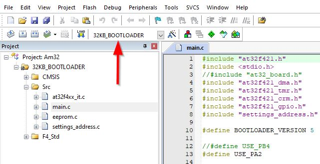

> [!IMPORTANT]
> This step only applies to an ESC that uses `PB4` as input signal pin. The RDQ 3-6S 32bit dShot1200 30A ESC is one of those ESCs.
> 
> Skip this step if you have the Holybro ESC. It uses default `PA2`.

8.  Changing the signal input pin in the Bootloader Source from the `PA2` to the `PB4`:
    - Double-click on main.c
    - Find the lines with the define macros for `USE_PA2`, `USE_PB4`.
    
      In the screenshot below, line 12 is commented out while line 13 is not commented out. Therefore `USE_PA2` is selected.
    
      To change that, remove the leading `//` in line 12 and add leading `//` in front of line 13.
    
    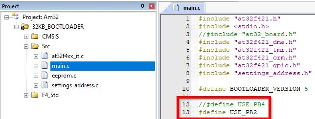

9.  Building the bootloader binary
    - Again check that you have target `32KB BOOTLOADER` selected. As pointed out earlier, the corresponding toolbar group is on the top left.
    - Click on `build` or better `rebuild`.
      If you just use `build` and changed the `target` previously, you will end up using already built artifacts for the previously selected target.
      This is an annoying caveat in uVision.

      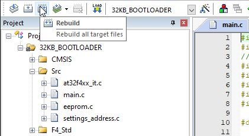
    - Check the build output.

      It may give warnings about some obsolete compiler flags but no errors.
     
      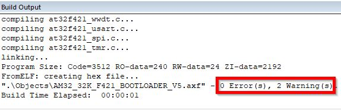

   At this point we have an ESC specific bootloader binary available.

> [!IMPORTANT]
> This following step depends on the ESC. To connect the debugger, you need the signal lines `SWC`, `SWD` and `GND`.
> 
> If you have test pads for this you can use that.
> 
> If you have no test pad for `GND` use the equal Battery Minus Pad.
> 
> If you have an MCU power supply test pad available like the `3V` pad on the Holybro ESC, you can power the MCU from the debugger during flashing.
> 
> If you don't have an MCU power supply test pad available, you're basically forced to power the ESC from the Battery Plus Pad. It may work with 5V from the debugger.

> [!Caution]
> If you're forced to work with battery voltage to power the ESC during this step, consider a lab power supply with tight set current limitation.
> 
> Causing some short circuit on the ESC while it's powered from a high power battery such as a 4S lipo, will ruin your day and the next.
> 
> With the Holybro ESC, the `SWC` pad is very close to a capacitor that is directly connected to battery plus. Creating a short circuit here will likely burn your ESC, your debugger and can even damage your PC.
> 
> When in doubt always apply isolation like capton tape to prevent such hazards.

10. Connecting the Debugger to the ESC
    - First check out the pinouts in this [guide](https://stm32-base.org/guides/connecting-your-debugger). You need `SWC`, `SWD` and `GND` at least.
    - Then check what test pads you have available on the ESC.
        - The Holybro ESC is perfect to be powered from the debugger. It has `SWC`, `SWD`, `GND` and `3V` test pads.
          `3V` pad is right next to the `GND` pad.

          
     
        - The RDQ ESC only has test pads for `SWC` and `SWD`. Therefore `GND` must be connected to the Battery Minus Pad.
          You can try to power the ESC from the debugger by connecting `5V` to the Battery Plus Pad.
          
    - The signal cables should all have roughly the same length and should be twisted together as shown here.
      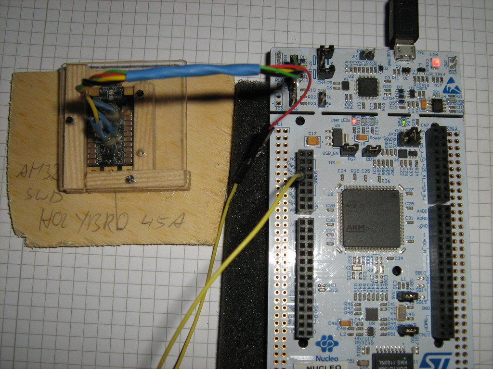

11. Checking if the debugger finds your powered target mcu.
    - In the tree view, right-click on the target name and left-click "Options for ..."

      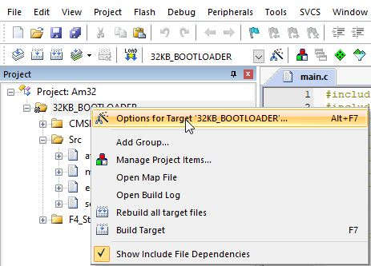
    - Go to Debug-Tab
    
      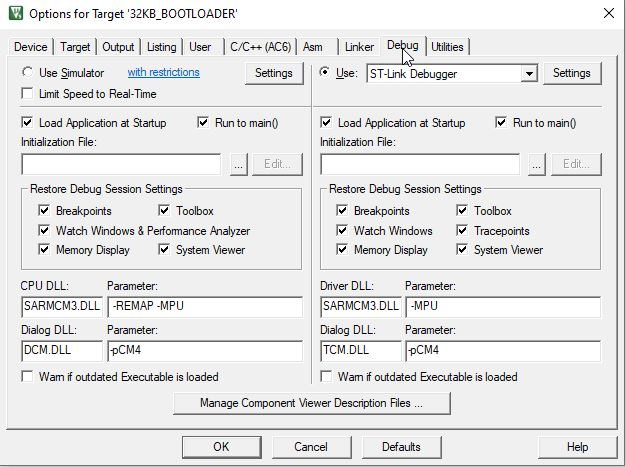
    - Click Settings
    
      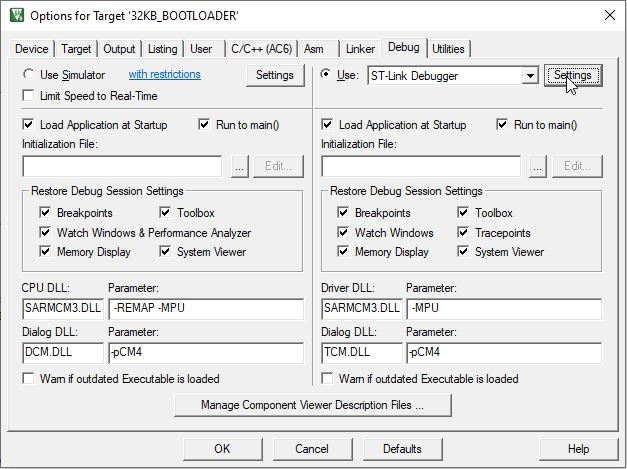

    - If everything is connected correctly, you will see your target under `SW Device`. If you see nothing here, check your wiring.

      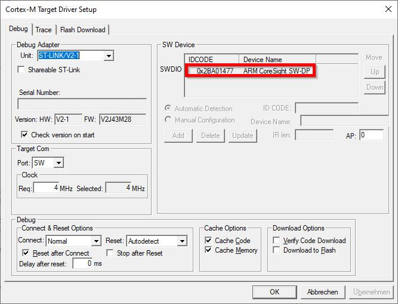

    Remember this dialog `Cortex-M Target Driver Setup`. We will return here a couple of times.

12. Invalidating the flash protection.

    This step intends to erase a specific memory area named `AT32F421 Flash user system data` including the fuses to unlock flash access via debugger.
    - Still in the `Cortex-M Target Driver Setup` dialog, go to the `Flash Download`-Tab.    
      This contains switches what uVision does when you press download. The radiobutton (red box) selects if a memory section is erased, leave it at `Erase Sectors`.
      The checkboxes (blue box) are steps executed from top to bottom. Leave it at `Program` + `Verify`. `Program` is the write flash operation. `Verify` is reading and comparing against the local binary.
      The table programming algorithm (green box) is crucial. It masks the memory sections for the whole procedure. Here the default content is shown.
    
      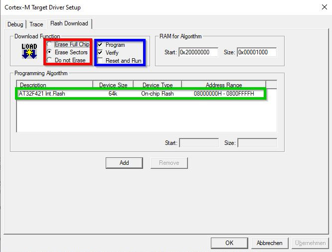
    - When you click on `Add`, you see that you actually have 3 different sections available for this chip.
    
      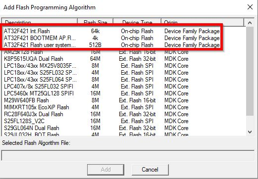
    - By using Add and Remove Buttons, change the table that `AT32F421 Flash user system data` is the only entry.
      Remember how it looks before your changes because you will change it back to this state in the next step.
    
      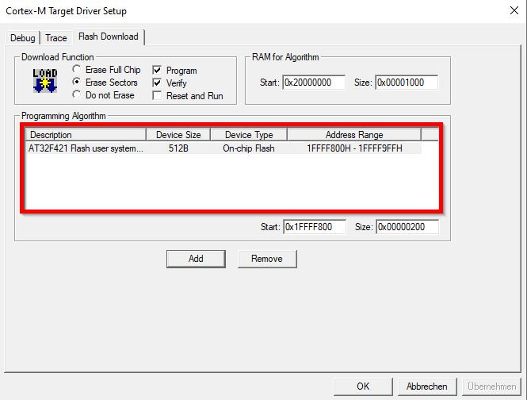

    - Close all dialogs by Clicking OK.
    - Download.

      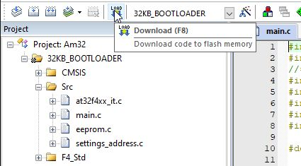
      
      It will throw this error popup, because that memory resets to zero on write, thus verify fails!
    
      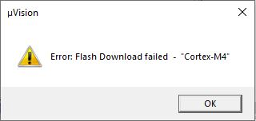
      
      The log will contain something similar to these lines.
    
      ```
      No Algorithm found for: 08000000H - 08000EAFH
      No Algorithm found for: 08000FE0H - 08000FE3H
      Partial Erase Done (areas with no algorithms skipped!)
      No Algorithm found for: 08000000H - 08000EAFH
      No Algorithm found for: 08000FE0H - 08000FE3H
      Partial Programming Done (areas with no algorithms skipped!)
      Contents mismatch at: 1FFFF800H  (Flash=00H  Required=A5H) !
      Contents mismatch at: 1FFFF801H  (Flash=00H  Required=5AH) !
      Contents mismatch at: 1FFFF802H  (Flash=00H  Required=FFH) !
      Contents mismatch at: 1FFFF804H  (Flash=00H  Required=FFH) !
      Contents mismatch at: 1FFFF806H  (Flash=00H  Required=FFH) !
      Contents mismatch at: 1FFFF808H  (Flash=00H  Required=FFH) !
      Contents mismatch at: 1FFFF80AH  (Flash=00H  Required=FFH) !
      Verify Failed!
      Error: Flash Download failed  -  "Cortex-M4"
      ```

13. Flashing the actual Bootloader
    - Go back to the Programming Algorithm Table and change it back to previous state, that you end up with only `AT32F421 Int. Flash`.

    - Return to the main screen and download like in the previous step.

      The log will contain something similar to these lines. It must end with `Partial Verify OK`.
      Ignore the warning `No Algorithm found for: 1FFFF800H - 1FFFF80BH`. That is the deselected `AT32F421 Flash user system data` area.
      ```
      No Algorithm found for: 1FFFF800H - 1FFFF80BH
      Partial Erase Done (areas with no algorithms skipped!)
      No Algorithm found for: 1FFFF800H - 1FFFF80BH
      Partial Programming Done (areas with no algorithms skipped!)
      Partial Verify OK (areas with no algorithms skipped!)
      ```
    
    After this step you are done with uVision and the Debugger.

## Step By Step Guide to Flash the Firmware

1. Download the ESC Config Tool:
    - Go to [https://am32.ca/downloads](https://am32.ca/downloads), browse for tools and download ESC Config Tool for your platform.
    - Unzip to a folder

> [!IMPORTANT]
> One of the big caveats in the next step is to select the correct firmware.
> The names of the images do not match the ESC they are intended for.
> In the opposite, they can be misleading in choosing the wrong firmware.
> The firmware naming is based on hardware designs and there is a limited number of common designs that are reused between different manufacturers.
> Logically the first ESC that the firmware / config is written for provides the name of the firmware.
> - The Holybro ESC uses a firmware WRAITH32_F421. [WRAITH32](https://www.rcgroups.com/forums/showthread.php?2869110-The-First-BLHeli_32-ESC-Wraith32-32bit-35A-DSHOT1200) is an early BLHELI32 design that the Holybro ESC is based on, therefore the name. You can also find some [Airbot Wraith32](https://www.getfpv.com/airbot-wraith32-v2-blheli32-35a-esc.html) that looks nearly identical.
> - The RDQ ESC uses a firmware TEKKO32_F421.


2. Download the firmware image:
    - Go to [https://am32.ca/downloads](https://am32.ca/downloads), browse for releases, currently 2.12
    - For the Holybro Tekko32 45A Single-ESC, the file is [AM32_WRAITH32_F421_2.12.hex](https://am32.ca/api/file/cmVsZWFzZXM6djIuMTIvQU0zMl9XUkFJVEgzMl9GNDIxXzIuMTIuaGV4)
    - For the RDQ 3-6S 32bit dShot1200 30A ESC, the filename is [AM32_TEKKO32_F421_2.12.hex](https://am32.ca/api/file/cmVsZWFzZXM6djIuMTIvQU0zMl9URUtLTzMyX0Y0MjFfMi4xMi5oZXg=)

3. Connect the ESC via Interface to the PC:
    - You can use a Betaflight Flight Controller as passthrough interface or an Arduino as direct connection.
    - If you use an Arduino, use BLHeliSuite to flash the 1-wire sketch. Below you see an Arduino Nano Clone with Atmega328p (old Bootloader). 
    - Connect PWM-Signal and GND between Interface and ESC. On the Arduino, PWM is connected to D3.
    - Optionally connect a bare motor without propeller to the ESC as well, so you can hear the beeps.
      

4. Connect with ESC Config Tool:
    - start `SerialPortConnector` application

    

    - select the correct port
    - if using an arduino, select direct connection
    - Connect
    - Power the ESC
    - Go to *Flash*-Tab (1) and select the motor your ESC is attached to (2).
    - Click *Load Firmware* (3) and select the downloaded firmware file.
    - Click *Flash Firmware* (4)

    

    After approx. 20 seconds flashing should be complete and the ESC will beep the motor.
5.  Final Sanity Checks:
    - Disconnect
    - Unpower the ESC
    - Power the ESC
    - Connect again.
    - Select the correct motor and check that it actually shows settings, it can take more than one click on the motor.
    - On the bottom of the Settings, there is a label for firmware name and version.
      Verify it's not `NEOESC f051 FW Rev: 1.35` but the firmware you just flashed.


## Pogo Pin Harness
- Create a box on a baseplate with 3 side walls and fix it on the coordinate table.
- For each of the side walls
  - Align the drill's axis to the center of the side wall.
  - Drill a hole in the top plate and the side wall.
  - Fix it with a small screw.
- You should now have a 3-point fix between the "box" and the top plate.
- Position the esc inside and for each of the pads (3V, GND, SWC, SWD)
  - Unmount the top plate.
  - Align the drill's axis to the pad
  - Mount and drill a hole in the top plate only
- You should now have a "box" with a top plate and 4 holes pointing down directly onto the pads.
- Prepare 4 pogo pins with a wire soldered to the side near the top.

  Don't solder the top, it has something similar to a venting hole, so the spring can freely move.

- Add shims between the walls and the top plate. The thickness of the shims define the spring force that's pushing the pogo pins onto the pads.

  It must not exceed the spring travel.
- Insert a pogo pin through each hole, align it to the pad and glue it to the top plate.

  Thick gelee type glue is more forgiving than hot glue here.
- When the top glue has dried, glue from bottom with a bit of epoxy and apply it with a toothpick.

  Don't glue the spring part accidentally!
- When done remove the shims and verify that all pogo pins are aligned and touch their corresponding pad. That's it!

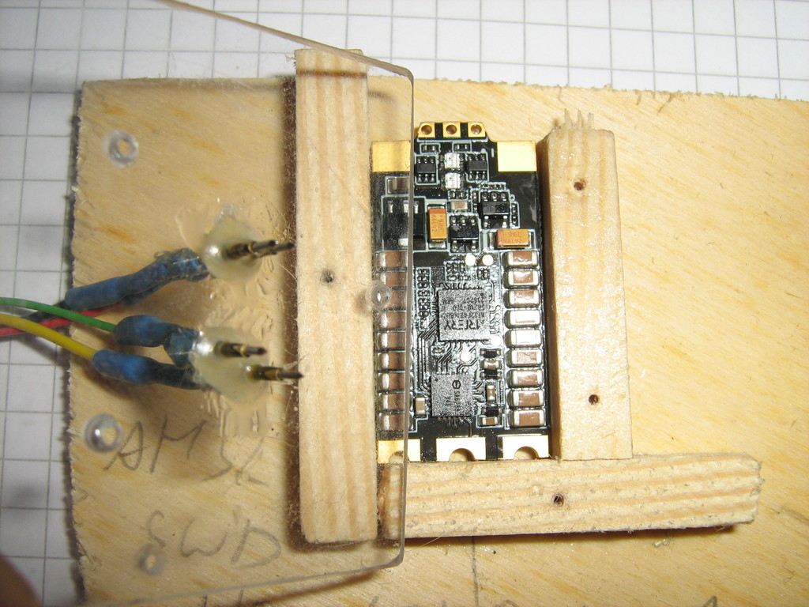
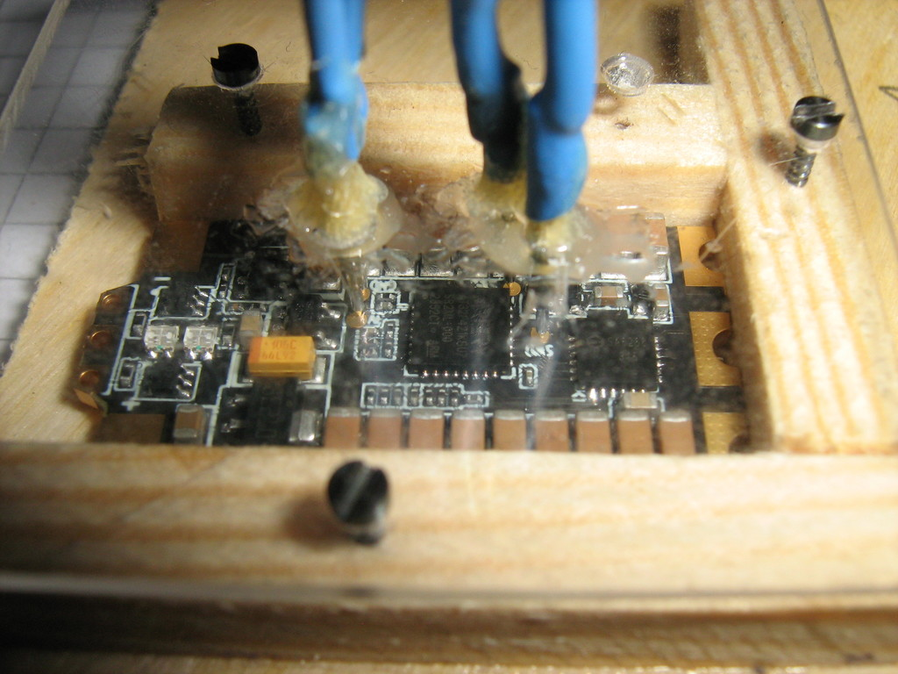

